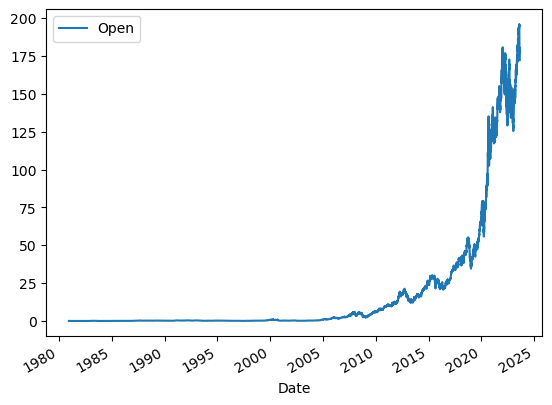
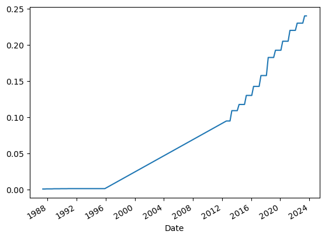

# Extracting Stock Data Using a Python Library


```python
!pip install yfinance==0.2.4
```

    Defaulting to user installation because normal site-packages is not writeable
    Requirement already satisfied: yfinance==0.2.4 in c:\users\cashapona\appdata\roaming\python\python39\site-packages (0.2.4)
    Requirement already satisfied: pandas>=1.3.0 in c:\programdata\anaconda3\lib\site-packages (from yfinance==0.2.4) (1.4.3)
    Requirement already satisfied: cryptography>=3.3.2 in c:\programdata\anaconda3\lib\site-packages (from yfinance==0.2.4) (37.0.1)
    Requirement already satisfied: numpy>=1.16.5 in c:\programdata\anaconda3\lib\site-packages (from yfinance==0.2.4) (1.21.5)
    Requirement already satisfied: multitasking>=0.0.7 in c:\users\cashapona\appdata\roaming\python\python39\site-packages (from yfinance==0.2.4) (0.0.11)
    Requirement already satisfied: beautifulsoup4>=4.11.1 in c:\programdata\anaconda3\lib\site-packages (from yfinance==0.2.4) (4.11.1)
    Requirement already satisfied: lxml>=4.9.1 in c:\programdata\anaconda3\lib\site-packages (from yfinance==0.2.4) (4.9.1)
    Requirement already satisfied: appdirs>=1.4.4 in c:\programdata\anaconda3\lib\site-packages (from yfinance==0.2.4) (1.4.4)
    Requirement already satisfied: pytz>=2022.5 in c:\users\cashapona\appdata\roaming\python\python39\site-packages (from yfinance==0.2.4) (2023.3)
    Requirement already satisfied: frozendict>=2.3.4 in c:\users\cashapona\appdata\roaming\python\python39\site-packages (from yfinance==0.2.4) (2.3.8)
    Requirement already satisfied: html5lib>=1.1 in c:\users\cashapona\appdata\roaming\python\python39\site-packages (from yfinance==0.2.4) (1.1)
    Requirement already satisfied: requests>=2.26 in c:\programdata\anaconda3\lib\site-packages (from yfinance==0.2.4) (2.28.1)
    Requirement already satisfied: soupsieve>1.2 in c:\programdata\anaconda3\lib\site-packages (from beautifulsoup4>=4.11.1->yfinance==0.2.4) (2.3.1)
    Requirement already satisfied: cffi>=1.12 in c:\programdata\anaconda3\lib\site-packages (from cryptography>=3.3.2->yfinance==0.2.4) (1.15.1)
    Requirement already satisfied: six>=1.9 in c:\programdata\anaconda3\lib\site-packages (from html5lib>=1.1->yfinance==0.2.4) (1.16.0)
    Requirement already satisfied: webencodings in c:\programdata\anaconda3\lib\site-packages (from html5lib>=1.1->yfinance==0.2.4) (0.5.1)
    Requirement already satisfied: python-dateutil>=2.8.1 in c:\programdata\anaconda3\lib\site-packages (from pandas>=1.3.0->yfinance==0.2.4) (2.8.2)
    Requirement already satisfied: urllib3<1.27,>=1.21.1 in c:\programdata\anaconda3\lib\site-packages (from requests>=2.26->yfinance==0.2.4) (1.26.11)
    Requirement already satisfied: certifi>=2017.4.17 in c:\programdata\anaconda3\lib\site-packages (from requests>=2.26->yfinance==0.2.4) (2022.6.15)
    Requirement already satisfied: charset-normalizer<3,>=2 in c:\programdata\anaconda3\lib\site-packages (from requests>=2.26->yfinance==0.2.4) (2.0.4)
    Requirement already satisfied: idna<4,>=2.5 in c:\programdata\anaconda3\lib\site-packages (from requests>=2.26->yfinance==0.2.4) (3.3)
    Requirement already satisfied: pycparser in c:\programdata\anaconda3\lib\site-packages (from cffi>=1.12->cryptography>=3.3.2->yfinance==0.2.4) (2.21)
    


```python
import yfinance as yf
import pandas as pd
```


```python
apple = yf.Ticker("AAPL")
```


```python
import requests

url = 'https://cf-courses-data.s3.us.cloud-object-storage.appdomain.cloud/IBMDeveloperSkillsNetwork-PY0220EN-SkillsNetwork/data/apple.json'
response = requests.get(url)
with open('apple.json') as json_file:
    apple_info = json.load(json_file)
apple_info
```


    {'zip': '95014',
     'sector': 'Technology',
     'fullTimeEmployees': 100000,
     'longBusinessSummary': 'Apple Inc. designs, manufactures, and markets smartphones, personal computers, tablets, wearables, and accessories worldwide. It also sells various related services. In addition, the company offers iPhone, a line of smartphones; Mac, a line of personal computers; iPad, a line of multi-purpose tablets; AirPods Max, an over-ear wireless headphone; and wearables, home, and accessories comprising AirPods, Apple TV, Apple Watch, Beats products, HomePod, and iPod touch. Further, it provides AppleCare support services; cloud services store services; and operates various platforms, including the App Store that allow customers to discover and download applications and digital content, such as books, music, video, games, and podcasts. Additionally, the company offers various services, such as Apple Arcade, a game subscription service; Apple Music, which offers users a curated listening experience with on-demand radio stations; Apple News+, a subscription news and magazine service; Apple TV+, which offers exclusive original content; Apple Card, a co-branded credit card; and Apple Pay, a cashless payment service, as well as licenses its intellectual property. The company serves consumers, and small and mid-sized businesses; and the education, enterprise, and government markets. It distributes third-party applications for its products through the App Store. The company also sells its products through its retail and online stores, and direct sales force; and third-party cellular network carriers, wholesalers, retailers, and resellers. Apple Inc. was incorporated in 1977 and is headquartered in Cupertino, California.',
     'city': 'Cupertino',
     'phone': '408 996 1010',
     'state': 'CA',
     'country': 'United States',
     'companyOfficers': [],
     'website': 'https://www.apple.com',
     'maxAge': 1,
     'address1': 'One Apple Park Way',
     'industry': 'Consumer Electronics',
     'ebitdaMargins': 0.33890998,
     'profitMargins': 0.26579002,
     'grossMargins': 0.43019,
     'operatingCashflow': 112241000448,
     'revenueGrowth': 0.112,
     'operatingMargins': 0.309,
     'ebitda': 128217997312,
     'targetLowPrice': 160,
     'recommendationKey': 'buy',
     'grossProfits': 152836000000,
     'freeCashflow': 80153247744,
     'targetMedianPrice': 199.5,
     'currentPrice': 177.77,
     'earningsGrowth': 0.25,
     'currentRatio': 1.038,
     'returnOnAssets': 0.19875,
     'numberOfAnalystOpinions': 44,
     'targetMeanPrice': 193.53,
     'debtToEquity': 170.714,
     'returnOnEquity': 1.45567,
     'targetHighPrice': 215,
     'totalCash': 63913000960,
     'totalDebt': 122797998080,
     'totalRevenue': 378323009536,
     'totalCashPerShare': 3.916,
     'financialCurrency': 'USD',
     'revenuePerShare': 22.838,
     'quickRatio': 0.875,
     'recommendationMean': 1.8,
     'exchange': 'NMS',
     'shortName': 'Apple Inc.',
     'longName': 'Apple Inc.',
     'exchangeTimezoneName': 'America/New_York',
     'exchangeTimezoneShortName': 'EDT',
     'isEsgPopulated': False,
     'gmtOffSetMilliseconds': '-14400000',
     'quoteType': 'EQUITY',
     'symbol': 'AAPL',
     'messageBoardId': 'finmb_24937',
     'market': 'us_market',
     'annualHoldingsTurnover': None,
     'enterpriseToRevenue': 7.824,
     'beta3Year': None,
     'enterpriseToEbitda': 23.086,
     '52WeekChange': 0.4549594,
     'morningStarRiskRating': None,
     'forwardEps': 6.56,
     'revenueQuarterlyGrowth': None,
     'sharesOutstanding': 16319399936,
     'fundInceptionDate': None,
     'annualReportExpenseRatio': None,
     'totalAssets': None,
     'bookValue': 4.402,
     'sharesShort': 111286790,
     'sharesPercentSharesOut': 0.0068,
     'fundFamily': None,
     'lastFiscalYearEnd': 1632528000,
     'heldPercentInstitutions': 0.59397,
     'netIncomeToCommon': 100554997760,
     'trailingEps': 6.015,
     'lastDividendValue': 0.22,
     'SandP52WeekChange': 0.15217662,
     'priceToBook': 40.38392,
     'heldPercentInsiders': 0.0007,
     'nextFiscalYearEnd': 1695600000,
     'yield': None,
     'mostRecentQuarter': 1640390400,
     'shortRatio': 1.21,
     'sharesShortPreviousMonthDate': 1644883200,
     'floatShares': 16302795170,
     'beta': 1.185531,
     'enterpriseValue': 2959991898112,
     'priceHint': 2,
     'threeYearAverageReturn': None,
     'lastSplitDate': 1598832000,
     'lastSplitFactor': '4:1',
     'legalType': None,
     'lastDividendDate': 1643932800,
     'morningStarOverallRating': None,
     'earningsQuarterlyGrowth': 0.204,
     'priceToSalesTrailing12Months': 7.668314,
     'dateShortInterest': 1647302400,
     'pegRatio': 1.94,
     'ytdReturn': None,
     'forwardPE': 27.099087,
     'lastCapGain': None,
     'shortPercentOfFloat': 0.0068,
     'sharesShortPriorMonth': 108944701,
     'impliedSharesOutstanding': 0,
     'category': None,
     'fiveYearAverageReturn': None,
     'previousClose': 178.96,
     'regularMarketOpen': 178.55,
     'twoHundredDayAverage': 156.03505,
     'trailingAnnualDividendYield': 0.004833482,
     'payoutRatio': 0.1434,
     'volume24Hr': None,
     'regularMarketDayHigh': 179.61,
     'navPrice': None,
     'averageDailyVolume10Day': 93823630,
     'regularMarketPreviousClose': 178.96,
     'fiftyDayAverage': 166.498,
     'trailingAnnualDividendRate': 0.865,
     'open': 178.55,
     'toCurrency': None,
     'averageVolume10days': 93823630,
     'expireDate': None,
     'algorithm': None,
     'dividendRate': 0.88,
     'exDividendDate': 1643932800,
     'circulatingSupply': None,
     'startDate': None,
     'regularMarketDayLow': 176.7,
     'currency': 'USD',
     'trailingPE': 29.55445,
     'regularMarketVolume': 92633154,
     'lastMarket': None,
     'maxSupply': None,
     'openInterest': None,
     'marketCap': 2901099675648,
     'volumeAllCurrencies': None,
     'strikePrice': None,
     'averageVolume': 95342043,
     'dayLow': 176.7,
     'ask': 178.53,
     'askSize': 800,
     'volume': 92633154,
     'fiftyTwoWeekHigh': 182.94,
     'fromCurrency': None,
     'fiveYearAvgDividendYield': 1.13,
     'fiftyTwoWeekLow': 122.25,
     'bid': 178.4,
     'tradeable': False,
     'dividendYield': 0.005,
     'bidSize': 3200,
     'dayHigh': 179.61,
     'regularMarketPrice': 177.77,
     'preMarketPrice': 178.38,
     'logo_url': 'https://logo.clearbit.com/apple.com'}


```python
apple_info['country']
```


    'United States'


### 1) Getting the share price of the stock over a certain period of time and using the period parameter to set how far back from we want to get data


```python
apple_share_price_data = apple.history(period="max")
apple_share_price_data
```


<div>
<style scoped>
    .dataframe tbody tr th:only-of-type {
        vertical-align: middle;
    }

    .dataframe tbody tr th {
        vertical-align: top;
    }

    .dataframe thead th {
        text-align: right;
    }
</style>
<table border="1" class="dataframe">
  <thead>
    <tr style="text-align: right;">
      <th></th>
      <th>Open</th>
      <th>High</th>
      <th>Low</th>
      <th>Close</th>
      <th>Volume</th>
      <th>Dividends</th>
      <th>Stock Splits</th>
    </tr>
    <tr>
      <th>Date</th>
      <th></th>
      <th></th>
      <th></th>
      <th></th>
      <th></th>
      <th></th>
      <th></th>
    </tr>
  </thead>
  <tbody>
    <tr>
      <th>1980-12-12 00:00:00-05:00</th>
      <td>0.099450</td>
      <td>0.099882</td>
      <td>0.099450</td>
      <td>0.099450</td>
      <td>469033600</td>
      <td>0.0</td>
      <td>0.0</td>
    </tr>
    <tr>
      <th>1980-12-15 00:00:00-05:00</th>
      <td>0.094694</td>
      <td>0.094694</td>
      <td>0.094261</td>
      <td>0.094261</td>
      <td>175884800</td>
      <td>0.0</td>
      <td>0.0</td>
    </tr>
    <tr>
      <th>1980-12-16 00:00:00-05:00</th>
      <td>0.087775</td>
      <td>0.087775</td>
      <td>0.087343</td>
      <td>0.087343</td>
      <td>105728000</td>
      <td>0.0</td>
      <td>0.0</td>
    </tr>
    <tr>
      <th>1980-12-17 00:00:00-05:00</th>
      <td>0.089504</td>
      <td>0.089937</td>
      <td>0.089504</td>
      <td>0.089504</td>
      <td>86441600</td>
      <td>0.0</td>
      <td>0.0</td>
    </tr>
    <tr>
      <th>1980-12-18 00:00:00-05:00</th>
      <td>0.092099</td>
      <td>0.092532</td>
      <td>0.092099</td>
      <td>0.092099</td>
      <td>73449600</td>
      <td>0.0</td>
      <td>0.0</td>
    </tr>
    <tr>
      <th>...</th>
      <td>...</td>
      <td>...</td>
      <td>...</td>
      <td>...</td>
      <td>...</td>
      <td>...</td>
      <td>...</td>
    </tr>
    <tr>
      <th>2023-08-14 00:00:00-04:00</th>
      <td>177.970001</td>
      <td>179.690002</td>
      <td>177.309998</td>
      <td>179.460007</td>
      <td>43675600</td>
      <td>0.0</td>
      <td>0.0</td>
    </tr>
    <tr>
      <th>2023-08-15 00:00:00-04:00</th>
      <td>178.880005</td>
      <td>179.479996</td>
      <td>177.050003</td>
      <td>177.449997</td>
      <td>43622600</td>
      <td>0.0</td>
      <td>0.0</td>
    </tr>
    <tr>
      <th>2023-08-16 00:00:00-04:00</th>
      <td>177.130005</td>
      <td>178.539993</td>
      <td>176.500000</td>
      <td>176.570007</td>
      <td>46964900</td>
      <td>0.0</td>
      <td>0.0</td>
    </tr>
    <tr>
      <th>2023-08-17 00:00:00-04:00</th>
      <td>177.139999</td>
      <td>177.509995</td>
      <td>173.479996</td>
      <td>174.000000</td>
      <td>66062900</td>
      <td>0.0</td>
      <td>0.0</td>
    </tr>
    <tr>
      <th>2023-08-18 00:00:00-04:00</th>
      <td>172.300003</td>
      <td>175.100006</td>
      <td>171.960007</td>
      <td>174.490005</td>
      <td>61114200</td>
      <td>0.0</td>
      <td>0.0</td>
    </tr>
  </tbody>
</table>
<p>10761 rows × 7 columns</p>
</div>


```python
apple_share_price_data.head()
```


<div>
<style scoped>
    .dataframe tbody tr th:only-of-type {
        vertical-align: middle;
    }

    .dataframe tbody tr th {
        vertical-align: top;
    }

    .dataframe thead th {
        text-align: right;
    }
</style>
<table border="1" class="dataframe">
  <thead>
    <tr style="text-align: right;">
      <th></th>
      <th>Open</th>
      <th>High</th>
      <th>Low</th>
      <th>Close</th>
      <th>Volume</th>
      <th>Dividends</th>
      <th>Stock Splits</th>
    </tr>
    <tr>
      <th>Date</th>
      <th></th>
      <th></th>
      <th></th>
      <th></th>
      <th></th>
      <th></th>
      <th></th>
    </tr>
  </thead>
  <tbody>
    <tr>
      <th>1980-12-12 00:00:00-05:00</th>
      <td>0.099450</td>
      <td>0.099882</td>
      <td>0.099450</td>
      <td>0.099450</td>
      <td>469033600</td>
      <td>0.0</td>
      <td>0.0</td>
    </tr>
    <tr>
      <th>1980-12-15 00:00:00-05:00</th>
      <td>0.094694</td>
      <td>0.094694</td>
      <td>0.094261</td>
      <td>0.094261</td>
      <td>175884800</td>
      <td>0.0</td>
      <td>0.0</td>
    </tr>
    <tr>
      <th>1980-12-16 00:00:00-05:00</th>
      <td>0.087775</td>
      <td>0.087775</td>
      <td>0.087343</td>
      <td>0.087343</td>
      <td>105728000</td>
      <td>0.0</td>
      <td>0.0</td>
    </tr>
    <tr>
      <th>1980-12-17 00:00:00-05:00</th>
      <td>0.089504</td>
      <td>0.089937</td>
      <td>0.089504</td>
      <td>0.089504</td>
      <td>86441600</td>
      <td>0.0</td>
      <td>0.0</td>
    </tr>
    <tr>
      <th>1980-12-18 00:00:00-05:00</th>
      <td>0.092099</td>
      <td>0.092532</td>
      <td>0.092099</td>
      <td>0.092099</td>
      <td>73449600</td>
      <td>0.0</td>
      <td>0.0</td>
    </tr>
  </tbody>
</table>
</div>


```python
apple_share_price_data.reset_index(inplace=True)
apple_share_price_data
```


<div>
<style scoped>
    .dataframe tbody tr th:only-of-type {
        vertical-align: middle;
    }

    .dataframe tbody tr th {
        vertical-align: top;
    }

    .dataframe thead th {
        text-align: right;
    }
</style>
<table border="1" class="dataframe">
  <thead>
    <tr style="text-align: right;">
      <th></th>
      <th>Date</th>
      <th>Open</th>
      <th>High</th>
      <th>Low</th>
      <th>Close</th>
      <th>Volume</th>
      <th>Dividends</th>
      <th>Stock Splits</th>
    </tr>
  </thead>
  <tbody>
    <tr>
      <th>0</th>
      <td>1980-12-12 00:00:00-05:00</td>
      <td>0.099450</td>
      <td>0.099882</td>
      <td>0.099450</td>
      <td>0.099450</td>
      <td>469033600</td>
      <td>0.0</td>
      <td>0.0</td>
    </tr>
    <tr>
      <th>1</th>
      <td>1980-12-15 00:00:00-05:00</td>
      <td>0.094694</td>
      <td>0.094694</td>
      <td>0.094261</td>
      <td>0.094261</td>
      <td>175884800</td>
      <td>0.0</td>
      <td>0.0</td>
    </tr>
    <tr>
      <th>2</th>
      <td>1980-12-16 00:00:00-05:00</td>
      <td>0.087775</td>
      <td>0.087775</td>
      <td>0.087343</td>
      <td>0.087343</td>
      <td>105728000</td>
      <td>0.0</td>
      <td>0.0</td>
    </tr>
    <tr>
      <th>3</th>
      <td>1980-12-17 00:00:00-05:00</td>
      <td>0.089504</td>
      <td>0.089937</td>
      <td>0.089504</td>
      <td>0.089504</td>
      <td>86441600</td>
      <td>0.0</td>
      <td>0.0</td>
    </tr>
    <tr>
      <th>4</th>
      <td>1980-12-18 00:00:00-05:00</td>
      <td>0.092099</td>
      <td>0.092532</td>
      <td>0.092099</td>
      <td>0.092099</td>
      <td>73449600</td>
      <td>0.0</td>
      <td>0.0</td>
    </tr>
    <tr>
      <th>...</th>
      <td>...</td>
      <td>...</td>
      <td>...</td>
      <td>...</td>
      <td>...</td>
      <td>...</td>
      <td>...</td>
      <td>...</td>
    </tr>
    <tr>
      <th>10756</th>
      <td>2023-08-14 00:00:00-04:00</td>
      <td>177.970001</td>
      <td>179.690002</td>
      <td>177.309998</td>
      <td>179.460007</td>
      <td>43675600</td>
      <td>0.0</td>
      <td>0.0</td>
    </tr>
    <tr>
      <th>10757</th>
      <td>2023-08-15 00:00:00-04:00</td>
      <td>178.880005</td>
      <td>179.479996</td>
      <td>177.050003</td>
      <td>177.449997</td>
      <td>43622600</td>
      <td>0.0</td>
      <td>0.0</td>
    </tr>
    <tr>
      <th>10758</th>
      <td>2023-08-16 00:00:00-04:00</td>
      <td>177.130005</td>
      <td>178.539993</td>
      <td>176.500000</td>
      <td>176.570007</td>
      <td>46964900</td>
      <td>0.0</td>
      <td>0.0</td>
    </tr>
    <tr>
      <th>10759</th>
      <td>2023-08-17 00:00:00-04:00</td>
      <td>177.139999</td>
      <td>177.509995</td>
      <td>173.479996</td>
      <td>174.000000</td>
      <td>66062900</td>
      <td>0.0</td>
      <td>0.0</td>
    </tr>
    <tr>
      <th>10760</th>
      <td>2023-08-18 00:00:00-04:00</td>
      <td>172.300003</td>
      <td>175.100006</td>
      <td>171.960007</td>
      <td>174.490005</td>
      <td>61114200</td>
      <td>0.0</td>
      <td>0.0</td>
    </tr>
  </tbody>
</table>
<p>10761 rows × 8 columns</p>
</div>


### 2) Finding the volume of Apple shares traded on the first day


```python
apple_share_price_data.iloc[0,5]
```


    469033600


```python
apple_share_price_data.plot(x="Date", y="Open")
```


    <AxesSubplot:xlabel='Date'>


    

    


```python
apple.dividends
```


    Date
    1987-05-11 00:00:00-04:00    0.000536
    1987-08-10 00:00:00-04:00    0.000536
    1987-11-17 00:00:00-05:00    0.000714
    1988-02-12 00:00:00-05:00    0.000714
    1988-05-16 00:00:00-04:00    0.000714
                                   ...   
    2022-08-05 00:00:00-04:00    0.230000
    2022-11-04 00:00:00-04:00    0.230000
    2023-02-10 00:00:00-05:00    0.230000
    2023-05-12 00:00:00-04:00    0.240000
    2023-08-11 00:00:00-04:00    0.240000
    Name: Dividends, Length: 80, dtype: float64


```python
apple.dividends.plot()
```


    <AxesSubplot:xlabel='Date'>


    

    

